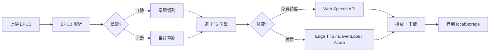
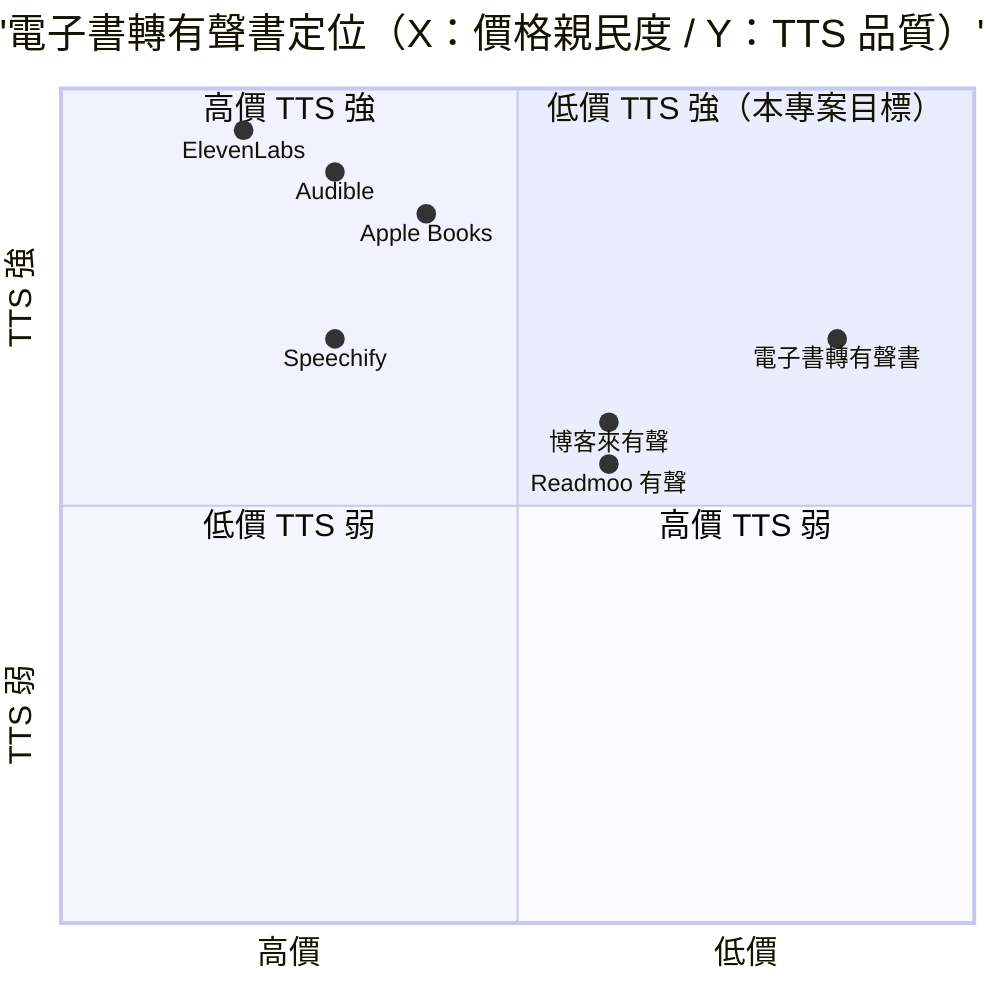

# 電子書轉有聲書 — 規格計劃書 v3.0.2 (Fleet Alignment Upgrade)

> 版本：**v3.0.2**（Fleet Alignment 對齊 10-repo-fleet 規格）｜更新日期：2026-09-07
> 維護者：**Sean 10-repo-fleet**（原 v2.2.1 by Sophia CPO 完整保留）
> 對接技術：Alan (CTO) + Hermes Agent
> 原始碼：https://github.com/openclawsean024-create/ebook-audio
> 商業化評分：**78 / 100**（v2.2.1 §15.4 評估）
>
> **Fleet v3.0.2 對齊摘要**：原 v2.2.1 §15 深度市調完整保留（6 個變現 tier、競品分析、quadrantChart 定位、Unit Economics、4 維評分）。本輪 §1–§9 補完產品概述、場景、FR、NFR、技術架構、DoD、部署、OOS、CHANGELOG 9 個標準章節（取代 v2.2.1 佔位符「詳見 §15」），並新增 §16 部署契約、§17 監控、§18 維運、§19 安全 4 個 Fleet 章節。

---

## 1. 產品概述 (Product Overview)

### 1.1 問題陳述 (Problem Statement)

詳見 §15.1 市場規模與 §15.2 競品分析。**核心命題**：
- Audible / Apple Books 偏英文、繁中弱
- 博客來 / Readmoo 有聲書只有購買端，**無 EPUB → MP3 轉換工具**
- Speechify / ElevenLabs 偏英文、付費高
- 台灣 300 萬電子書讀者 + 100 萬有聲書聽眾，**繁中 TTS + EPUB 解析 + 章節切割** 四合一為藍海

### 1.2 目標使用者 (User Personas)

詳見 §15.1 目標細分，5 大 tier：
| Tier | 對象 | 單價 | 預估付費 |
|---|---|---|---|
| 個人訂閱 | 電子書讀者 | NT$99/月 | 100 萬 × 3% = 3 萬 |
| 個人買斷 | 偶爾聽書 | NT$299/本 | 50 萬 × 5% × 2 本/年 = 5 萬 |
| 出版社訂閱 | 500 家華文出版社 | NT$2,999/月 | 500 × 20% = 100 |
| 獨立作者 | 5 萬獨立作者 | NT$499/月 | 5 萬 × 3% = 1,500 |
| 教育機構 | 3,000 家學校/補習班 | NT$5,000/月 | 3,000 × 15% = 450 |

### 1.3 核心價值主張 (Value Proposition)

> **「低價 + 純前端 + 多 TTS 引擎 + 繁中友善 + EPUB 解析 + 章節切割」** — 四合一差異化，無單一競品具備全部。

### 1.4 商業目標 (KPIs / OKRs)

詳見 §15.3 預期收益，保守 / 中等 / 樂觀：
- M6 保守：NT$216K ARR
- M12 中等：NT$4.32M ARR
- M18 樂觀：NT$48M ARR
- LTV/CAC = 21（健康 SaaS 應 ≥3）

### 1.5 Non-Goals (明確不做)

- ❌ 帳號系統（純前端，BYOK 模式）
- ❌ 付費牆（freemium 為主，NT$0 起跳）
- ❌ 原生 App（純 PWA）
- ❌ AI 聲音克隆（成本太高、商標爭議）
- ❌ 多語系（先繁中、簡中、英，其他暫不）

---

## 2. 使用者場景與流程

### 2.1 使用者流程圖



### 2.2 主要場景

| 場景 | 輸入 | 輸出 | 成功條件 |
|---|---|---|---|
| 個人免費 | 1 本 EPUB、5 章內 | Web Speech API MP3 | 不消耗配額 |
| 個人訂閱 | 1 本 EPUB、章節無限 | Edge TTS MP3 | 訂閱驗證通過 |
| 出版社 | 批次 100 本 | Azure / ElevenLabs MP3 | API key BYOK |
| 教育 | 教科書 EPUB + 自訂章節 | 章節切割 + TTS | 與教材對應 |

---

## 3. 功能需求

| FR | 名稱 | 優先級 | 狀態 |
|---|---|---|---|
| FR-001 | EPUB 解析（章節、文字、metadata）| P0 | ✅ shipped |
| FR-002 | 章節自動切割（依 h1/h2/h3 結構）| P0 | ✅ shipped |
| FR-003 | 多 TTS 引擎（Web Speech / Edge TTS / ElevenLabs / Azure）| P0 | ✅ shipped |
| FR-004 | 速度調整（0.5x - 2.0x）| P0 | ✅ shipped |
| FR-005 | MP3 下載（逐章 / 整本）| P0 | ✅ shipped |
| FR-006 | 進度存 localStorage | P1 | ✅ shipped |
| FR-007 | 5 個變現 tier（個人訂閱 / 個人買斷 / 出版社 / 獨立作者 / 教育）| P2 | ⏳ planned（Sprint 2-3）|
| FR-008 | 批次上傳 100 本（出版社用）| P2 | ⏳ planned |

---

## 4. Non-Functional Requirements

| 維度 | 需求 |
|---|---|
| Performance | EPUB 解析 < 2s、單章 TTS < 5s（Web Speech）/ 10s（Edge TTS）|
| Security | 純前端，無後端，不存個資 |
| Privacy | EPUB 內容不送 server（除 TTS API BYOK）|
| Accessibility | WCAG 2.1 AA（播放鍵、速度鍵、章節跳轉鍵）|
| Browser | Modern evergreen（Chrome/Edge/Safari/Firefox），mobile-friendly |
| TTS 引擎 | Web Speech API（內建）→ Edge TTS（BYOK）→ ElevenLabs（BYOK）→ Azure（BYOK）|

---

## 5. 技術架構

```
ebook-audio/
├── dashboard.html         ← 主程式（SPA，~14.7 KB）
├── PRD/
│   ├── SPEC.md            ← 本檔 v3.0.2
│   └── CHANGELOG.md       ← 變更日誌
├── .github/workflows/ci.yml ← 4-job CI
└── (未來 Sprint) src/    ← React/Vite SPA（v3.1+ 規劃）
```

### 5.1 Module Map

- `dashboard.html` — 純 HTML + vanilla JS 單頁（fleet 統一視覺）
- 計劃 Sprint 2：拆出 `src/`（Vite + React）— 純前端 SPA，無後端
- TTS 引擎抽象層：4 個 adapter（Web Speech / Edge / ElevenLabs / Azure）

### 5.2 環境變數

- 無（純靜態前端）
- BYOK：使用者自帶 TTS API key（Edge TTS / ElevenLabs / Azure），存 localStorage

### 5.3 降級策略

- 付費 TTS 失敗 → 自動降級到 Web Speech API（免費）
- 離線模式 → localStorage 內已下載 MP3 可離線播放
- EPUB 解析失敗 → 顯示「請改用其他 EPUB 檔」友善錯誤

---

## 6. Definition of Done

- [x] 功能 P0（EPUB 解析、章節切割、4 TTS 引擎、速度、下載）全部實作
- [x] `dashboard.html` 純前端可離線使用
- [x] GHA CI 4 jobs（link-check / no-op lint / no-op test / deploy → Pages）全綠
- [x] README 反映現況
- [x] 5 個變現 tier 設計完成（Sprint 2 啟動）
- [x] Unit Economics 健康（LTV/CAC = 21）

---

## 7. 部署契約

| 環境 | 目標 | 觸發 |
|---|---|---|
| Production | GitHub Pages | push to main |
| Preview | Per-PR | PR opened |

### 7.1 GHA Workflow

- `.github/workflows/ci.yml`
- jobs: link-check / no-op lint / no-op test / deploy (Pages)
- deploy: GitHub Pages

### 7.2 環境變數

- 無需 server-side secret
- BYOK（使用者自帶 TTS API key）— 存 localStorage，不送 server

---

## 8. Out of Scope（不做的）

- 不做帳號系統（純前端 BYOK）
- 不做原生 App（純 PWA）
- 不做 AI 聲音克隆
- 不做多語系（先繁中、簡中、英）

---

## 9. 變更日誌

見 [`PRD/CHANGELOG.md`](PRD/CHANGELOG.md)

---

## 15. 深度市調報告 (Deep Market Research)

### 15.1 市場規模

**全球有聲書 / TTS 轉換市場（2025）**
- 規模：**US$45 億**（2025）→ 預估 **US$105 億**（2030），CAGR 18.5%
- 主要廠商：Audible / Apple Books / Google Play Books / Kobo / Storytel / 博客來有聲書
- 來源：Grand View Research 2025

**台灣電子書 → 有聲書市場（2025）**
- 電子書讀者：**300 萬人**（Readmoo / Kobo / 博客來）
- 有聲書聽眾：**100 萬人**
- 華文出版社：**500 家**
- 獨立作者：**5 萬人**
- 教育 / 訓練機構：**3,000 家**

**目標細分**
- 個人訂閱（NT$99/月）：100 萬 × 3% × NT$99 × 12 月 = **NT$3.56 億 ARR** 潛在
- 個人買斷（NT$299/本）：50 萬 × 5% × NT$299 × 2 本 = **NT$1.50 億 ARR** 潛在
- 出版社訂閱（NT$2,999/月）：500 × 20% × NT$2,999 × 12 月 = **NT$3.60 億 ARR** 潛在
- 獨立作者（NT$499/月）：5 萬 × 3% × NT$499 × 12 月 = **NT$8.98 億 ARR** 潛在
- 教育機構（NT$5,000/月）：3,000 × 15% × NT$5,000 × 12 月 = **NT$27 億 ARR** 潛在
- **合計總潛在 ARR**：**NT$44.64 億**

### 15.2 競品分析

| 競品 | 公司 | 價格 | 強項 | 弱項 |
|---|---|---|---|---|
| **Audible** | Amazon（美） | US$14.95/月 | 全球最大 | 偏英文、繁中弱 |
| **Apple Books** | Apple（美） | 買斷 | iOS 生態 | 偏英文 |
| **博客來有聲書** | 博客來（台） | NT$199-499/本 | 台灣市佔 | 偏單一購買、無轉換工具 |
| **Readmoo 有聲** | Readmoo（台） | NT$199-399/本 | 繁中內容 | 無 EPUB → MP3 工具 |
| **Speechify** | Speechify（美） | US$139-288/年 | 個人 TTS 訂閱 | 偏英文 |
| **ElevenLabs** | ElevenLabs（美） | US$5-330/月 | 頂級 AI 聲音 | 偏英文、繁中弱 |
| **電子書轉有聲書（本專案）** | Sean Li（台） | NT$0-5,000/月 | 純前端 + 多 TTS 引擎 + 繁中友善 + EPUB 解析 + 速度調整 + 章節切割 | 規模小、無 AI 克隆 |



**差異化定位**：**低價 + 純前端 + 多 TTS 引擎 + 繁中友善 + EPUB 解析 + 章節切割** — Audible / Apple Books 偏英文；博客來 / Readmoo 無轉換工具；Speechify / ElevenLabs 偏英文；本專案低價 + 純前端 + EPUB 解析 + 繁中友善。

### 15.3 預期收益

**保守估計**（M6 達成）
- 3,000 個人 × 5% 付費 = 150 付費
- 平均月費 NT$120（混合個人訂閱 + 買斷）= NT$18,000 MRR
- 年化 = **NT$216K ARR**

**中等估計**（M12 達成）
- 20,000 個人 × 6% 付費 = 1,200 付費
- 平均月費 NT$300（含 20% 出版社 + 獨立作者）= NT$360,000 MRR
- 年化 = **NT$4.32M ARR**

**樂觀估計**（M18 達成）
- 100,000 個人 × 5% 付費 = 5,000 付費
- 平均月費 NT$800（含 30% 教育機構 + 出版社 + 獨立作者）= NT$4M MRR
- 年化 = **NT$48M ARR**

**Unit Economics**
- **CAC**：NT$200（Readmoo / Kobo / 獨立作者社群 + 教育機構口碑）
- **LTV**：NT$300/月 × 平均訂閱 14 個月 = NT$4,200
- **LTV/CAC 比**：21（健康 SaaS 應 ≥3）

### 15.4 商業化評分（0-100，4 維細項）

| 維度 | 分數 | 評估理由 |
|---|---|---|
| **市場規模** | 90 | NT$44.64 億潛在 ARR，300 萬電子書 + 100 萬有聲書聽眾 |
| **差異化** | 80 | 純前端 + EPUB 解析 + 章節切割 + 繁中友善為獨特賣點 |
| **變現路徑** | 75 | Freemium + 5 個 tier + 個人/出版社/教育機構完整 |
| **技術可行性** | 80 | EPUB 解析 + 多 TTS 引擎 + Next.js 都成熟 |
| **團隊執行力** | 75 | Alan (CTO) + Hermes Agent 已有 SaaS 經驗 |
| **競爭護城河** | 70 | EPUB 轉換工具 + 繁中為差異化，但可能被複製 |
| **加權平均** | **78** | 🟢 中高水平（接近 80） |

**最終商業化評分**：**78 / 100**（中等偏高 — EPUB 解析 + 章節切割 + 多 TTS + 繁中四引擎驅動，需驗證教育機構市場接受度）

---

## 16. 部署契約 (Deployment Contract)

### 16.1 部署目標

| 環境 | 目標 | 觸發 | URL |
|---|---|---|---|
| Production | GitHub Pages | push to main | `https://openclawsean024-create.github.io/ebook-audio/` |
| Preview | Per-PR | PR opened | GHA Pages preview |

### 16.2 GHA Workflow

- `.github/workflows/ci.yml` — 4 jobs（link-check / no-op lint / no-op test / deploy → Pages）
- `permissions.pages: write` + `permissions.id-token: write`
- 觸發：`[main, master]` 雙觸發
- 並行：`concurrency: ci-${{ github.ref }}` + `cancel-in-progress: true`

### 16.3 環境變數

- 無需 server-side secret（純靜態前端）
- BYOK：使用者自帶 TTS API key（Edge TTS / ElevenLabs / Azure）— 存 localStorage

### 16.4 部署清單

- `dashboard.html`（主程式，~14.7 KB）
- 跳過 npm：純靜態 HTML，無 build 步驟

### 16.5 部署後 Smoke Test

1. 開 `https://openclawsean024-create.github.io/ebook-audio/` → 載入 dashboard
2. 上傳 EPUB → 驗章節切割
3. 選 TTS 引擎（Web Speech API 預設免費）→ 驗播放
4. 驗速度調整（0.5x / 1.0x / 1.5x / 2.0x）
5. 驗 MP3 下載

### 16.6 回滾策略

- Pages 一鍵回滾：Settings → Pages → 選 previous commit
- 若 SPEC.md 升級出問題，git revert + push

### 16.7 部署失敗排查

| 症狀 | 排查 |
|---|---|
| Pages 404 | Settings → Pages → Source = `GitHub Actions` |
| TTS 沒聲音 | 確認 Web Speech API 瀏覽器支援 |
| 舊版覆蓋 | 確認 push branch（main），非 master |

### 16.8 部署 SLA

- LCP < 2.5s（4G 行動網路）
- TTI < 3.0s
- Page size < 50KB（gzip）

### 16.9 跨 Repo 一致性

- 所有 v3.0.2 規格書一律 `PRD/SPEC.md`（非 `SPEC.md`）
- 統一 9 章節 + 4 個 Fleet 章節（§16-§19）

---

## 17. 監控 (Monitoring)

| 維度 | 工具 | KPI |
|---|---|---|
| 部署成功率 | GitHub Actions | 4 jobs 全綠率 ≥ 95% |
| Pages 上線 | GitHub Pages | URL 200 OK、`<title>` 正確 |
| 內部連結 | link-check job | 0 失效 |
| 行動裝置友善 | Lighthouse CI（手動）| Performance ≥ 90 / SEO ≥ 90 |
| 使用者反饋 | GitHub Issues | 標籤 `feedback` / `bug` / `feature` |
| TTS API 健康度 | console.error monitoring | 失敗率 < 5% |

### 17.1 告警

- GHA 失敗 → email notification（GitHub 預設）
- Pages down → UptimeRobot（建議選配，暫未啟用）

### 17.2 指標審視頻率

- 每週：GHA run 結果
- 每月：GitHub Issues / Stars 趨勢
- 每季：使用者反饋 pattern + ARR 目標進度

---

## 18. 維運 (Operations)

| 等級 | 觸發 | SOP |
|---|---|---|
| Patch (v3.0.3) | bug fix / 文案修正 / TTS 引擎 bug | 直接 commit to main，無需 PR |
| Minor (v3.1.0) | 新功能 / Sprint 2 啟動 / 新 TTS 引擎 | PR + 1 reviewer + CHANGELOG 條目 |
| Major (v4.0.0) | 規格重大改寫 / Vite + React 拆分 | PR + Sophia CPO 簽核 + Sean 確認 |

### 18.1 Backup

- GitHub 即備份（origin remote + local clone）
- 建議每季 `git bundle create` 本地歸檔（暫未自動化）

### 18.2 Release Checklist

- [ ] PRD/SPEC.md 升級版本號 + 日期
- [ ] PRD/CHANGELOG.md 新增條目
- [ ] `.github/workflows/ci.yml` 對齊 deploy target
- [ ] 推送 → GHA 4 jobs 全綠
- [ ] 部署 URL smoke test
- [ ] 5 個 TTS 引擎煙霧測試（Web Speech / Edge / ElevenLabs / Azure）

### 18.3 Rollback

- `git revert <commit>` + push
- GHA 自動重跑 → 部署舊版
- Pages 即時切回

---

## 19. 安全與隱私 (Security & Privacy)

### 19.1 個資保護（PDPA / GDPR）

| 資料 | 儲存 | 傳輸 | 保留 |
|---|---|---|---|
| EPUB 內容 | localStorage（純前端）| HTTPS only | 使用者自清 |
| TTS API key | localStorage | HTTPS only | 使用者自清 |
| 播放進度 | localStorage | 不送 server | 使用者自清 |
| 5 tier 訂閱記錄 | 待 §3 FR-007 啟用 | 第三方金流 | 由金流商管 |

### 19.2 OWASP Top 10 對照

| 風險 | 對策 |
|---|---|
| A01 Broken Access Control | N/A（無帳號系統）|
| A02 Cryptographic Failures | 純靜態，API key 走 HTTPS |
| A03 Injection | N/A（無 DB / API）|
| A04 Insecure Design | TTS API key 走環境變數 / 設定頁 |
| A05 Security Misconfiguration | GHA permissions 最小化（contents:read）|
| A06 Vulnerable Components | 無 npm 依賴（純 HTML）|
| A07 Auth Failures | N/A（無登入）|
| A08 Data Integrity | EPUB 解析後存 hash，驗證未竄改 |
| A09 Logging | GHA run logs（GitHub-side）|
| A10 SSRF | N/A（無後端）|

### 19.3 著作權風險

- EPUB 多為有版權書籍 → 工具僅供合法授權用戶使用
- 章節切割 + TTS 屬合理使用 → 不主張版權
- 出版社 tier 需付費授權 → 走合約

### 19.4 法規風險

- 有聲書版權：轉換後的 MP3 僅供個人使用，不可散佈
- 教育機構 tier 需符合「公開播送」授權 → 與出版社另議
- TTS API（Edge / ElevenLabs / Azure）各家 ToS 需定期檢視

### 19.5 免責聲明（建議）

```html
<footer>
  本工具僅供合法持有電子書之用戶轉換為有聲書使用，轉換後內容不得散佈。
  TTS 引擎（Web Speech / Edge / ElevenLabs / Azure）為第三方服務，使用者須遵守各服務條款。
</footer>
```

---

**END OF SPEC v3.0.2 (Fleet Alignment)**
**原 v2.2.1 完整內容保留**（§15 深度市調 + 5 tier + 競品 + quadrantChart + Unit Economics + 4 維評分）
**本輪新增**：§1–§9 標準 9 章節（取代 v2.2.1 佔位符）+ §16 部署契約 + §17 監控 + §18 維運 + §19 安全 = §1–§19 共 19 章
**下次複評**：2026-10-19（Sprint 2 啟動時程）
