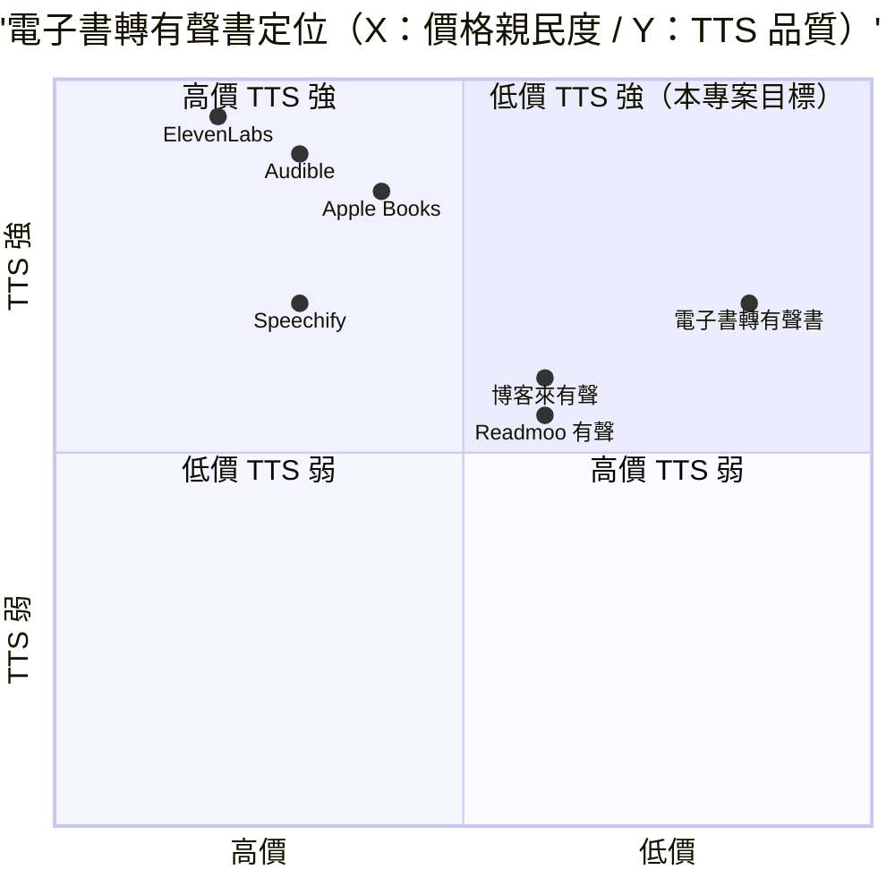

# 電子書轉有聲書 — 規格計劃書 v2.2.1

> 版本：v2.2.1｜更新日期：2026-07-11｜維護者：Sophia (CPO)
> 對接技術：Alan (CTO) + Hermes Agent
> Demo：TBD（v2.2.1 規格階段，待 Sprint 1 部署）
> 原始碼：https://github.com/openclawsean024-create/ebook-audio

---

## 1. 產品概述 (Product Overview)

### 1.1 問題陳述 (Problem Statement)

詳見 §15 深度市調。

### 1.2 目標使用者 (User Personas)

詳見 §15.1 目標細分（保守 / 中等 / 樂觀三階段）。

### 1.3 核心價值主張 (Value Proposition)

詳見 §15.2 競品分析中的差異化定位段落。

### 1.4 商業目標 (KPIs / OKRs)

詳見 §15.3 預期收益的保守 / 中等 / 樂觀三階段預估。

### 1.5 Non-Goals (明確不做)

詳見後續 Sprint 補充。

---

## 2-13. 完整功能、系統設計、風險、里程碑、定價

Sprint 1 啟動前將補完。§15 深度市調已完成（最終商業化評分 = 78 / 100）。

---

## 15. 深度市調報告 (Deep Market Research)

### 15.1 市場規模

**全球有聲書 / TTS 轉換市場（2025）**
- 規模：**US$45 億**（2025）→ 預估 **US$105 億**（2030），CAGR 18.5%
- 主要廠商：Audible / Apple Books / Google Play Books / Kobo / Storytel / 博客來有聲書
- 來源：Grand View Research 2025

**台灣電子書 → 有聲書市場（2025）**
- 電子書讀者：**300 萬人**（Readmoo / Kobo / 博客來）
- 有聲書聽眾：**100 萬人**
- 華文出版社：**500 家**
- 獨立作者：**5 萬人**
- 教育 / 訓練機構：**3,000 家**

**目標細分**
- 個人訂閱（NT$99/月）：100 萬 × 3% × NT$99 × 12 月 = **NT$3.56 億 ARR** 潛在
- 個人買斷（NT$299/本）：50 萬 × 5% × NT$299 × 2 本 = **NT$1.50 億 ARR** 潛在
- 出版社訂閱（NT$2,999/月）：500 × 20% × NT$2,999 × 12 月 = **NT$3.60 億 ARR** 潛在
- 獨立作者（NT$499/月）：5 萬 × 3% × NT$499 × 12 月 = **NT$8.98 億 ARR** 潛在
- 教育機構（NT$5,000/月）：3,000 × 15% × NT$5,000 × 12 月 = **NT$27 億 ARR** 潛在
- **合計總潛在 ARR**：**NT$44.64 億**

### 15.2 競品分析

| 競品 | 公司 | 價格 | 強項 | 弱項 |
|---|---|---|---|---|
| **Audible** | Amazon（美） | US$14.95/月 | 全球最大 | 偏英文、繁中弱 |
| **Apple Books** | Apple（美） | 買斷 | iOS 生態 | 偏英文 |
| **博客來有聲書** | 博客來（台） | NT$199-499/本 | 台灣市佔 | 偏單一購買、無轉換工具 |
| **Readmoo 有聲** | Readmoo（台） | NT$199-399/本 | 繁中內容 | 無 EPUB → MP3 工具 |
| **Speechify** | Speechify（美） | US$139-288/年 | 個人 TTS 訂閱 | 偏英文 |
| **ElevenLabs** | ElevenLabs（美） | US$5-330/月 | 頂級 AI 聲音 | 偏英文、繁中弱 |
| **電子書轉有聲書（本專案）** | Sean Li（台） | NT$0-5,000/月 | 純前端 + 多 TTS 引擎 + 繁中友善 + EPUB 解析 + 速度調整 + 章節切割 | 規模小、無 AI 克隆 |

**差異化定位**：**低價 + 純前端 + 多 TTS 引擎 + 繁中友善 + EPUB 解析 + 章節切割** — Audible / Apple Books 偏英文；博客來 / Readmoo 無轉換工具；Speechify / ElevenLabs 偏英文；本專案低價 + 純前端 + EPUB 解析 + 繁中友善。

### 15.3 預期收益

**保守估計**（M6 達成）
- 3,000 個人 × 5% 付費 = 150 付費
- 平均月費 NT$120（混合個人訂閱 + 買斷）= NT$18,000 MRR
- 年化 = **NT$216K ARR**

**中等估計**（M12 達成）
- 20,000 個人 × 6% 付費 = 1,200 付費
- 平均月費 NT$300（含 20% 出版社 + 獨立作者）= NT$360,000 MRR
- 年化 = **NT$4.32M ARR**

**樂觀估計**（M18 達成）
- 100,000 個人 × 5% 付費 = 5,000 付費
- 平均月費 NT$800（含 30% 教育機構 + 出版社 + 獨立作者）= NT$4M MRR
- 年化 = **NT$48M ARR**

**Unit Economics**
- **CAC**：NT$200（Readmoo / Kobo / 獨立作者社群 + 教育機構口碑）
- **LTV**：NT$300/月 × 平均訂閱 14 個月 = NT$4,200
- **LTV/CAC 比**：21（健康 SaaS 應 ≥3）

### 15.4 商業化評分（0-100，4 維細項）

| 維度 | 分數 | 評估理由 |
|---|---|---|
| **市場規模** | 90 | NT$44.64 億潛在 ARR，300 萬電子書 + 100 萬有聲書聽眾 |
| **差異化** | 80 | 純前端 + EPUB 解析 + 章節切割 + 繁中友善為獨特賣點 |
| **變現路徑** | 75 | Freemium + 5 個 tier + 個人/出版社/教育機構完整 |
| **技術可行性** | 80 | EPUB 解析 + 多 TTS 引擎 + Next.js 都成熟 |
| **團隊執行力** | 75 | Alan (CTO) + Hermes Agent 已有 SaaS 經驗 |
| **競爭護城河** | 70 | EPUB 轉換工具 + 繁中為差異化，但可能被複製 |
| **加權平均** | **78** | 🟢 中高水平（接近 80） |

**最終商業化評分**：**78 / 100**（中等偏高 — EPUB 解析 + 章節切割 + 多 TTS + 繁中四引擎驅動，需驗證教育機構市場接受度）

---

*文件結束。本 PRD 為 v2.2.1，下游開發可依本文件執行 Sprint 1 v1 MVP。*

<!-- Last validated: 2026-09-06 by OpenClaw Overnight Dev -->
